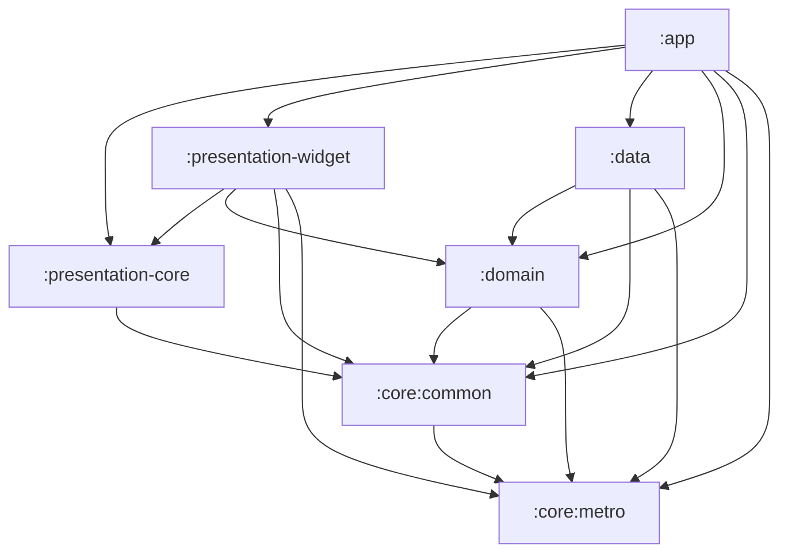

# 开发文档

> 面向在本仓库继续开发的人。本文描述的是**当前代码的实际状态**，不是最初的设计稿。

## 1. 项目概览

| 项 | 值 |
|---|---|
| 应用名 | 健身日程 |
| 工程名 | FitPlan（`rootProject.name`） |
| applicationId / namespace 根 | `com.fitplan.app` |
| 定位 | 纯本地、离线的健身计划与训练记录 App |
| 网络 | 无 `INTERNET` 权限，无账号、无云同步 |
| 语言 | 仅简体中文，文案直接写在各模块 `res/values/strings.xml` |
| UI | Kotlin + Jetpack Compose + Material3 Expressive |

核心能力：编排训练计划（routine）、把计划排到具体日期、逐组记录训练（重量/次数或计时）、查看统计趋势、桌面「今日训练」组件、启动时检查漏练并让用户顺延 / 跳过。

## 2. 技术栈（版本锁定在 `gradle/*.versions.toml`）

| 领域 | 组件 | 版本 |
|---|---|---|
| 构建 | Gradle Wrapper | 9.7.1 |
| 构建 | Android Gradle Plugin | 9.4.0 |
| 构建 | Kotlin | 2.4.20 |
| SDK | compileSdk / targetSdk / minSdk | 37.1 / 36 / 26 |
| JDK | 编译目标 java / CI 运行时 | 17 / 21 |
| DI | Metro（`metro-runtime`、`metrox-viewmodel`、`metrox-viewmodel-compose`） | 1.4.3 |
| 数据库 | SQLDelight（+ `sqldelight-androidx-driver`、`androidx.sqlite:sqlite-bundled`） | 2.3.2 / 0.2.2 |
| 导航 | Voyager（navigator / tab-navigator / transitions） | 2.2.21-1.10.3 |
| 图表 | Vico（compose / compose-m3 / compose-glance） | 3.2.3 |
| 桌面组件 | AndroidX Glance AppWidget | 1.2.0 |
| 时间 / 序列化 | kotlinx-datetime / kotlinx-serialization-json | 0.8.0 / 1.11.0 |
| 主题 | materialKolor、material-motion-compose | 5.0.1 / 2.0.1 |
| 列表交互 | reorderable、swipe | 3.1.0 / 1.3.0 |
| 代码格式 | Spotless + ktlint | 8.10.2 / 1.8.0 |
| 调试 | logcat、leakCanary-plumber | 0.4 / 2.14 |

> 两个版本目录分工：`gradle/fit.versions.toml`（catalog 名 `fitx`）只放 SDK/JDK 版本和自定义插件 ID；第三方依赖都在 `gradle/libs.versions.toml`（catalog 名 `libs`）。

## 3. 环境要求

1. **JDK 21**：CI 用 temurin 21；Android Studio 自带的 JetBrains Runtime 也可。Kotlin 编译目标是 17（`fit.versions.toml` 的 `java = "17"`）。
2. **Android SDK**：compileSdk 37.1、targetSdk 36、minSdk 26。首次打开工程时 Android Studio 会按 `local.properties`（已 gitignore）里的路径解析 SDK。
3. **Git 必须在 PATH 中**：`gradle/build-logic/.../Commands.kt` 在配置阶段会执行 `git rev-list --count HEAD`、`git rev-parse --short HEAD`、`git log -1 --format=%ct`，用于注入 `BuildConfig.COMMIT_COUNT / COMMIT_SHA / BUILD_TIME`。没有 git 会导致配置阶段失败。
4. **不要随意升级 Gradle / AGP**：`gradle/build-logic` 用了 AGP 9 的新 DSL（`compileSdk { version = release(...) }`、`ApplicationDefaultConfig`），降版本会编译失败。

## 4. 模块结构

`settings.gradle.kts` 目前 include 了 **7 个模块**：

```
:app                    入口、打包、业务 UI 与 ViewModel
:presentation-core      与业务无关的共享 Compose 组件 + 主题系统
:presentation-widget    Glance 桌面组件 + Vico 图表封装
:domain                 领域模型、repository 接口、interactor
:data                   SQLDelight schema、repository 实现、种子导入
:core:common            偏好存储、工具/扩展
:core:metro             DI 基建（GraphProvider / metroGraph / IsDebugBuild）
```

依赖方向（单向，下层不依赖上层）：



## 5. 关键目录

```
app/src/main/
  java/com/fitplan/
    App.kt                      Application：建图 + 注入 + 启动时导入种子动作
    app/di/AppGraph.kt          Metro @DependencyGraph + SqlDriver/Database/Json 绑定
    app/di/FitPlanViewModelFactory.kt
    app/di/AppGraphUtils.kt     Context.appGraph 扩展
    app/ui/main/MainActivity.kt 根 Navigator 入口
    ui/home/HomeScreen.kt       四个 Tab + NavigationSuiteScaffold + 漏练弹窗挂载点
    ui/{today,plan,stats,more}/ 各 Tab（`plan` Tab = 训练日历 `PlanTab.kt`）
    ui/plan/calendar/           训练日历组件 + 计划列表页 `RoutineListScreen`
    ui/plan/routine/            计划内动作编排页
    ui/missed/                  启动时的漏练弹窗（ScreenModel + 两步弹窗）
    ui/workout/                 训练记录页
    ui/exercise/                动作选择器
    app/data/DataRevision.kt    跨页面刷新信号（漏练处理后用）
    presentation/theme/         FitPlanTheme
    presentation/util/          Navigator/Screen/Tab/setComposeContent
  assets/exercises.json         60 条内置动作
  res/values/strings.xml        全部中文文案

data/src/main/sqldelight/com/fitplan/data/*.sq   表结构与查询
gradle/build-logic/                               自定义 Gradle 插件
.github/workflows/build.yml                       CI
```

## 6. 常用命令

Windows 用 `.\gradlew`，macOS/Linux 用 `./gradlew`。

| 目的 | 命令 |
|---|---|
| 检查代码格式 | `./gradlew spotlessCheck` |
| 自动格式化 | `./gradlew spotlessApply` |
| 单元测试 | `./gradlew testDebugUnitTest` |
| 校验 SQLDelight 迁移 | `./gradlew verifySqlDelightMigration` |
| 编译 Debug APK | `./gradlew assembleDebug` |
| 编译 Release APK | `./gradlew assembleRelease` |
| 装到已连接设备 | `./gradlew :app:installDebug` |
| 清理 | `./gradlew clean` |

产物路径：`app/build/outputs/apk/debug/app-debug.apk`。

## 7. 架构说明

### 7.1 依赖注入（Metro）

- `App` 实现 `GraphProvider<AppGraph>`，`graph` 通过 `createGraphFactory<AppGraph.Factory>().create(...)` 构建。
- `AppGraph` 是 `@DependencyGraph(scope = AppScope::class, bindingContainers = [AppBindings::class])` 且实现 `ViewModelGraph`，对外暴露 `inject(app)`、`inject(mainActivity)`、`viewModelFactory`、`context`、`isDebugBuild`、`widgetManager`。
- `AppBindings` 用 `@Provides` 提供 `SqlDriver`、`Database`、`Json`（均为 `@SingleIn(AppScope::class)`）。
- repository 实现用 `@Inject + @SingleIn(AppScope::class) + @ContributesBinding(AppScope::class)` 绑到 domain 接口。
- **ViewModel 必须在 `:app` 模块**（`@Inject @ViewModelKey @ContributesIntoMap(AppScope::class, binding = binding<ViewModel>())`），因为 Metro 的跨模块 map 贡献只支持实际参与编译的模块；`metroViewModel<T>()` 从 `LocalMetroViewModelFactory` 取。

### 7.2 导航（Voyager）

两层结构：`MainActivity` 起一个根 `Navigator(HomeScreen)`，`HomeScreen` 内是 `TabNavigator` + `NavigationSuiteScaffold`。

- 手机（`smallestScreenWidthDp < 600`）用 `NavigationBar`，平板用 `NavigationRail`。
- 四个 Tab：`TodayTab`(0) / `PlanTab`(1) / `StatsTab`(2) / `MoreTab`(3)。
- `PlanTab` 直接承载**训练日历**（用 `PlanCalendarScreenModel`），右上角按钮 push 全屏的**计划列表页** `RoutineListScreen`（用 `PlanScreenModel`）。两者互不依赖，各自复用对应 ScreenModel。
- `presentation/util/Navigator.kt` 提供 `Screen`（随机 screen key）、`Tab`（带 `onReselect`）、`DefaultNavigatorScreenTransition`、`LocalBackPress`。
- 从 Tab 内 push 的页面挂在根 Navigator 上（`HomeScreen` 里用 `CompositionLocalProvider(LocalNavigator provides navigator)`），因此返回行为统一。

### 7.3 数据层（SQLDelight）

- 配置在 `data/build.gradle.kts`：`packageName = "com.fitplan.data"`、`dialect(sqlite-3-38)`、`schemaOutputDirectory = data/src/main/sqldelight`、`generateAsync = true`。
- 驱动在 `AppGraph.providesSqlDriver`：`AndroidxSqliteDriver(BundledSQLiteDriver(), FileProvider(context, "fitplan.db"), schema = Database.Schema, ...)`，**开启了外键约束**。
- 数据库文件：`fitplan.db`，位于应用私有目录 `databases/` 下。
- 迁移文件目录：`data/src/main/sqldelight/com/fitplan/data/migrations/`（文件名是迁移**起始版本**，如 `5.sqm` 表示 schema 5→6；当前基线是 `1.db`，已经到 schema 8）。

表一览：

| 表 | 用途 |
|---|---|
| `exercise` | 动作库（内置种子 + 以后的自定义动作，`is_custom` 区分） |
| `routine` | 训练计划模板 |
| `routine_exercise` | 计划内的动作编排（`position` 排序，带目标组数/次数/组间休息） |
| `schedule_entry` | 排期（把某个计划排到具体日期 `specific_date` 上；周循环已在 schema 5→6 下线，`specific_date` 在 schema 7→8 加了唯一索引，**一天最多一条**） |
| `rest_day` | 编排出来的休息日（一天一行，`date` 为主键） |
| `workout_session` | 一次训练（`finished_at` 为 null 表示未完成） |
| `workout_set` | 每一组记录（`weight`/`reps` 或 `duration_seconds`） |
| `body_metric` | 体重/体脂记录（表已建，UI 尚未接入） |
| `seed_meta` | 单行表，记录已导入的种子版本 |

`Util.sq` 提供 `lastInsertRowId`（SQLDelight 的 insert 不返回自增主键，需要和 insert 放在同一事务里查询）。

外键级联：删计划会级联删 `routine_exercise` 与 `schedule_entry`；删训练会级联删 `workout_set`；删计划时 `workout_session.routine_id` 置空（保留历史）。

### 7.4 种子动作导入

`ExerciseSeeder`（`:data`）实现 `ExerciseSeedRepository`：

1. 从 `app/src/main/assets/exercises.json` 读 `{ "version": N, "exercises": [...] }`。
2. 读 `seed_meta.version`，相等则直接跳过。
3. 否则取 `exercise` 表里所有 `is_custom = 0` 的名字做去重集合，只插入不存在的新动作，**绝不覆盖/删除已有记录**。
4. 在一个事务里批量 `insertIgnore` 并 `upsertVersion`。

`App.onCreate` 在 `applicationScope` 里调用一次导入。当前种子版本为 `4`，共 60 条（胸 9 / 背 10 / 腿 10 / 臀 6 / 肩 8 / 二头 4 / 三头 5 / 腹 8）。

手臂肌群原本只有笼统的 `ARM`，从种子版本 4 起拆成 `BICEPS`（二头）与 `TRICEPS`（三头），
胸肩背动作的手臂次部位也按推拉模式细分；`ARM_OTHER`（其他手臂）只用于兼容老库里无法判定归属的自建动作。

### 7.5 主题

- `AppTheme` 枚举：`DEFAULT` / `GREEN_APPLE` / `MONOCHROME`（定义在 domain 的 `ui/model`）。
- `FitPlanTheme` 基于 `MaterialExpressiveTheme`，按 `AppTheme + isDark + isAmoled` 从对应 `BaseColorScheme`（`presentation-core/theme/colorscheme`）取 `ColorScheme`。
- 目前 `setComposeContent` 里**写死了 `AppTheme.DEFAULT`**，配色切换 UI 还未接入。

### 7.6 桌面组件

- Glance 组件定义在 `:presentation-widget`（`TodayWidget`），状态由 `:app` 的 `WidgetManager` 组装（今日排期 / 训练中组数 / 今日已完成组数 / 今天休息）。
- `TodayWidgetReceiver` 在 manifest 注册；训练数据或排期变化时 ScreenModel 调 `widgetManager.updateTodayWidget()` 主动重画。

### 7.7 漏练检查（打开 App 时）

打开 App 时若「上次训练之后」有**排了训练却没记录**的日子，先弹窗问用户怎么处理。

- 检测：`GetMissedTraining`（`:domain`）。区间取 `from = max(上次训练次日, 已处理日次日, 今天 - 60 天)` 到 `今天`（不含今天）；
  某天算漏练需同时满足：当天没有任何 `workout_session`（不看是否结束）、不在 `rest_day` 里、当天有启用的排期。
  完全没有训练记录时直接返回 `null`（全新安装不打扰）。`from` 同时是顺延的整体后移基准。
- 动作：`PostponeMissedTraining`（`ScheduleRepository.postponeMissedPlans`，一个事务里把 `[今天, ∞)` 的排期与休息日
  后移 `今天 - from` 天，再把漏掉的计划与漏掉区间里的休息日写到新位置）、`SkipMissedTraining`（`deleteOnceOn`，只删这些天的排期）。
- 完成标志：`MissedTrainingScreenModel` 处理完任一分支都把 `handledUntil = 今天` 写进偏好
  （`Preference.appStateKey("missed_training_handled_until")`，属于内部状态、不进备份），同一天不再追问。
- 挂载：`HomeScreen` 根页里的 `MissedTrainingPrompt()`，`LaunchedEffect` 兜底冷启动、`Lifecycle.Event.ON_START` 覆盖回到前台。
- 刷新：处理完 `DataRevision.bump()`，`TodayScreenModel` / `PlanCalendarScreenModel` 在 `init` 里订阅它重新取数
  （顺延会改动今天的排期，而这两个页面在启动时已经取过数了），并照例 `widgetManager.updateTodayWidget()`。

### 7.8 一天一个训练计划与「计划外训练」

- 排期一天只有一条：`schedule_entry.specific_date` 上有唯一索引（schema 7→8 的 `7.sqm` 先按日期去重再建索引），
  写排期一律走 `ScheduleRepository.replacePlanOn`（同一事务里先删该日再插入），界面上的写法是「替换」而不是「追加」。
- 日历明细里的「添加计划」只在**既没有排期、也没有实际训练**的空白天可用（`DayActionsRow.canAddPlan`），
  其余情况按钮置灰，用户只能改已有排期或改当天已记录的训练；`RecordPastWorkout` 也先查当天有没有训练记录，避免绕过界面重复补记。
- 今日页的完成态：`GetTodayWorkoutSession` 取「`started_at` 落在今天」的那次训练（结束与否都算）。
  已结束（`WorkoutSession.isFinished`）时，计划卡片的「开始训练」置灰，列表里补一句随机鼓励语
  （`R.array.today_encouragements`，进页面时随机取一条）和一张同规格的「计划外训练」卡片。
- 「开始训练（计划外）」= `WorkoutLogScreen(sessionId, reopen = true)`：`WorkoutRepository.reopenSession`
  把这次训练 `finished_at` 置空重新变成进行中，之后加的计划外动作与组都追加到**同一次训练**上（与训练中左下角
  「添加计划外动作」等价），练完点「结束训练」写回新的 `finished_at`，并刷新桌面组件。
- 日历里点今天/过去某天的「实际训练」进编辑页时，底部同样是「添加计划外动作」+ 红色「完成编辑」并排
  （共用 `WorkoutLogScreen` 的 `ExtraActionBar`，与训练中的「结束训练」排版一致）。

## 8. 开发规范

- **格式化**：Spotless + ktlint，规则来自 `.editorconfig`（Kotlin 4 空格缩进、最长 120 列、允许尾随逗号、禁用 star import 合并阈值）。提交前请跑 `spotlessApply`。
- **文案**：只支持简体中文，字符串写进对应模块的 `res/values/strings.xml`，代码里用 `stringResource`。`presentation-core` 的组件签名接收 `String`，不引入 i18n 框架。
- **架构约束**：上层可依赖下层，禁止反向依赖；`:domain` 不依赖 Android UI。
- **网络**：不添加 `INTERNET` 权限，不引入网络库。
- **新增第三方依赖前**：先加到 `libs.versions.toml`，不要在模块里写死版本号。

## 9. 新增一个页面 / 功能的步骤

以「体重记录」为例：

1. 在 `:app` 的 `ui/<feature>/` 下新建 `XxxScreenModel.kt`：

   ```kotlin
   @Inject
   @ViewModelKey
   @ContributesIntoMap(AppScope::class, binding = binding<ViewModel>())
   class BodyMetricScreenModel(
       private val bodyMetricRepository: BodyMetricRepository,
   ) : ViewModel() { /* StateFlow + viewModelScope */ }
   ```

2. 新建 `XxxScreen.kt`：全屏页继承 `presentation.util.Screen`，Tab 页实现 `presentation.util.Tab`。
3. 在 `App/src/main/res/values/strings.xml` 增加文案。
4. 用 `metroViewModel<XxxScreenModel>()` 取 ViewModel；跳转用 `navigator.push(XxxScreen(...))`。
5. 若要走底部导航，把它加入 `HomeScreen.TABS`。
6. 跑 `spotlessApply` + `assembleDebug` 验证。

## 10. 当前实现状态

已实现：

- 今日页（当天排期、未完成训练续练、开始训练入口、空态；**一天只有一个计划**——今天这次训练结束后计划卡片的「开始训练」置灰，下方出现随机鼓励语与「计划外训练」卡片，点它把今天的训练重新置为进行中继续加练）
- 计划 Tab = 训练日历（按月看每日肌群与实际训练、切月/回本月、点某天弹出明细；明细右下角「添加计划」（只在既没有排期也没有实际训练的空白天可用，其余情况置灰），点了把计划加到这一天——今天及以后写排期，已经过去的日子走 `RecordPastWorkout` 补记成一次已结束的训练（按计划目标铺满已完成组），「该天休息」把这一天标成休息日（顺带撤掉这一天的排期），两个动作互斥；过去的日子明细里只有「实际训练」一块（没练过显示 `calendar_day_no_actual`），不显示「当天计划」，但那天标过休息时仍列出可取消的「休息」条目；`GetMonthCalendar` 对过去的日子也只用实际训练算肌群与训练日高亮，遗留排期不参与显示（仍保留在库里，供 `GetMissedTraining` 判断漏练）；明细里三个条目（休息 / 当天计划 / 实际训练）都是整行一个色条，右侧的编辑、删除按钮含在色条内；实际训练条目用肌群标签那套 `surfaceVariant` 灰、第二行写「完成 N 组」，编辑是铅笔、删除是与当天计划一致的 ✕；点计划进编排页；休息日在格子里的日期底色与训练日同为蓝色系（今天及以后 `primary`，过去 `primaryContainer`），只有那行「休息」文字区分——今天及以后沿用 `tertiary` 深绿，过去改用肌群标签的 `surfaceVariant` 灰；休息日在明细里可取消）
- 编排健身计划页（日历右下角第二个 FAB 进入 → `PlanComposeScreen`）：用 Day 1/2/3… 卡片序列编排「训练计划 / 休息日」。`Day` 标签在卡片左侧（`Day` 换行 + 放大的序号，序号颜色跟随该格状态），卡片本身高 96dp、内容水平垂直居中；空槽是虚线灰底 + 加号，训练槽是实线蓝底（`primaryContainer`）显示计划名与肌群，休息槽是实线绿底（`tertiaryContainer`）。点空槽弹窗里选「训练」（淡蓝按钮 → 勾选计划 → 保存）或「休息」（淡绿按钮），点已填格可改选或「移除这一天」。顶部「应用」支持「循环次数」（1..52，默认 4）与「截止到」（DatePicker）两种铺法，单次最多铺 366 天；编排结束即丢弃，不落库
- 计划列表页（从日历右上角进入：新建/重命名/删除计划、动作选择器按肌群+器械筛选、动作编排与拖拽排序、目标值编辑）
- 训练记录页（逐组录入、计时动作、自动组间休息倒计时 + 震动、加/减组、跳过动作、计划外动作、备注、结束汇总、暂时退出保留进度、放弃删除；结束后的编辑态底部同样是「添加计划外动作」+ 红色「完成编辑」并排）
- 统计页（近 7 / 30 天，训练天数/训练次数/完成组数/平均每周训练天数概览，肌群组数分布与主要动作重量进步两张图，训练历史列表并可点进详情）
- 「今日训练」桌面组件
- 设置页（`MoreTab` → `SettingsScreen`）：训练提醒开关与提醒时间，通知 / 精确闹钟权限不给时给出降级提示与一键授权入口
- 关于页（`MoreTab` 里与「设置」并列的入口 → `AboutScreen`）：展示应用名与 `BuildConfig.VERSION_NAME`，点 GitHub 图标经 `ACTION_VIEW` 打开仓库
- 训练提醒（`reminder/ReminderScheduler`：AlarmManager 精确闹钟 + 通知渠道；`ReminderBootReceiver` 在开机与应用更新后重排；Android 13+ `POST_NOTIFICATIONS` 与 `SCHEDULE_EXACT_ALARM` 均做了降级）
- 启动时的漏练检查（`ui/missed/` 两步弹窗：顺延 / 跳过 / 「健身了，没写上去」；见 §7.7）
- 启动时种子动作导入

尚未实现 / 待办：

- **「我的」Tab 目前只有「设置」一个入口**（`MoreTab` 用 `IconItem` 列表，已不是 `EmptyScreen` 占位页）：动作库管理、体重记录都还没做。
- `body_metric` 表与 `BodyMetricRepository` 已就绪，但没有 UI 调用。
- 主题切换 UI 未接入（写死 DEFAULT）。
- 仓库目前**没有任何单元测试源码**（`testDebugUnitTest` 会空跑通过）。
- 桌面组件只有「今日训练」一个。

## 11. CI

`.github/workflows/build.yml`（ubuntu-24.04，JDK 21）依次执行：

1. `./gradlew spotlessCheck`
2. `./gradlew testDebugUnitTest`
3. `./gradlew verifySqlDelightMigration`
4. `./gradlew assembleDebug`
5. 上传 `app/build/outputs/apk/debug/app-debug.apk` 作为 artifact

测试失败时会上传测试报告。PR 触发时忽略 `**.md` 的改动。
