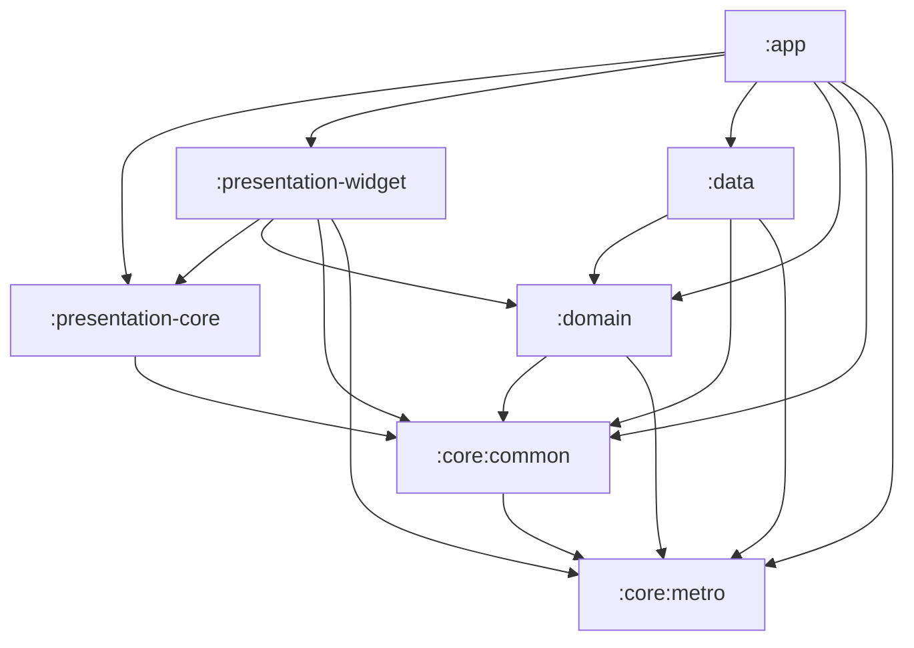

# 开发文档

> 面向在本仓库继续开发的人。本文描述的是**当前代码的实际状态**，不是最初的设计稿。

## 1. 项目概览

| 项 | 值 |
|---|---|
| 应用名 | Dascle |
| 工程名 | FitPlan（`rootProject.name`） |
| applicationId / namespace 根 | `com.fitplan.app` |
| 定位 | 纯本地、离线的健身计划与训练记录 App |
| 网络 | 只用于检查新版本（向 GitHub Releases 发只读请求）；无账号、无云同步、不上传数据 |
| 语言 | 仅简体中文，文案直接写在各模块 `res/values/strings.xml` |
| UI | Kotlin + Jetpack Compose + Material3 Expressive |

核心能力：编排训练计划（routine）、把计划排到具体日期、逐组记录训练（按动作类型记重量/次数或重量/时长）、查看统计趋势、桌面「今日训练」组件、启动时检查漏练并让用户顺延 / 跳过。

## 2. 技术栈（版本锁定在 `gradle/*.versions.toml`）

| 领域 | 组件 | 版本 |
|---|---|---|
| 构建 | Gradle Wrapper | 9.7.1 |
| 构建 | Android Gradle Plugin | 9.4.0 |
| 构建 | Kotlin | 2.4.20 |
| SDK | compileSdk / targetSdk / minSdk | 37.1 / 36 / 26 |
| JDK | 编译目标 java / CI 运行时 | 17 / 21 |
| DI | Metro（`metro-runtime`、`metrox-viewmodel`、`metrox-viewmodel-compose`） | 1.4.3 |
| 数据库 | SQLDelight（+ `sqldelight-androidx-driver`、`androidx.sqlite:sqlite-bundled`） | 2.3.2 / 0.2.2 |
| 导航 | Voyager（navigator / tab-navigator / transitions） | 2.2.21-1.10.3 |
| 图表 | Vico（compose / compose-m3 / compose-glance） | 3.2.3 |
| 桌面组件 | AndroidX Glance AppWidget | 1.2.0 |
| 时间 / 序列化 | kotlinx-datetime / kotlinx-serialization-json | 0.8.0 / 1.11.0 |
| 主题 | materialKolor、material-motion-compose | 5.0.1 / 2.0.1 |
| 列表交互 | reorderable、swipe | 3.1.0 / 1.3.0 |
| 代码格式 | Spotless + ktlint | 8.10.2 / 1.8.0 |
| 调试 | logcat、leakCanary-plumber | 0.4 / 2.14 |

> 两个版本目录分工：`gradle/fit.versions.toml`（catalog 名 `fitx`）只放 SDK/JDK 版本和自定义插件 ID；第三方依赖都在 `gradle/libs.versions.toml`（catalog 名 `libs`）。

## 3. 环境要求

1. **JDK 21**：CI 用 temurin 21；Android Studio 自带的 JetBrains Runtime 也可。Kotlin 编译目标是 17（`fit.versions.toml` 的 `java = "17"`）。
2. **Android SDK**：compileSdk 37.1、targetSdk 36、minSdk 26。首次打开工程时 Android Studio 会按 `local.properties`（已 gitignore）里的路径解析 SDK。
3. **Git 必须在 PATH 中**：`gradle/build-logic/.../Commands.kt` 在配置阶段会执行 `git rev-list --count HEAD`、`git rev-parse --short HEAD`、`git log -1 --format=%ct`，用于注入 `BuildConfig.COMMIT_COUNT / COMMIT_SHA / BUILD_TIME`。没有 git 会导致配置阶段失败。
4. **不要随意升级 Gradle / AGP**：`gradle/build-logic` 用了 AGP 9 的新 DSL（`compileSdk { version = release(...) }`、`ApplicationDefaultConfig`），降版本会编译失败。

## 4. 模块结构

`settings.gradle.kts` 目前 include 了 **7 个模块**：

```
:app                    入口、打包、业务 UI 与 ViewModel
:presentation-core      与业务无关的共享 Compose 组件 + 主题系统
:presentation-widget    Glance 桌面组件 + Vico 图表封装
:domain                 领域模型、repository 接口、interactor
:data                   SQLDelight schema、repository 实现、种子导入
:core:common            偏好存储、工具/扩展
:core:metro             DI 基建（GraphProvider / metroGraph / IsDebugBuild）
```

依赖方向（单向，下层不依赖上层）：


```mermaid
flowchart TD
    app[":app"]
    pWidget[":presentation-widget"]
    pCore[":presentation-core"]
    data[":data"]
    domain[":domain"]
    common[":core:common"]
    metro[":core:metro"]

    app --> pCore
    app --> pWidget
    app --> data
    app --> domain
    app --> common
    app --> metro
    pWidget --> pCore
    pWidget --> domain
    pWidget --> common
    pWidget --> metro
    pCore --> common
    data --> domain
    data --> common
    data --> metro
    domain --> common
    domain --> metro
    common --> metro
```

## 5. 关键目录

```
app/src/main/
  java/com/fitplan/
    App.kt                      Application：建图 + 注入 + 启动时导入种子动作
    app/di/AppGraph.kt          Metro @DependencyGraph + SqlDriver/Database/Json 绑定
    app/di/FitPlanViewModelFactory.kt
    app/di/AppGraphUtils.kt     Context.appGraph 扩展
    app/ui/main/MainActivity.kt 根 Navigator 入口（未完成首次引导时先显示引导页）
    ui/home/HomeScreen.kt       四个 Tab + NavigationSuiteScaffold + 漏练弹窗挂载点
    ui/{today,plan,stats,more}/ 各 Tab（`plan` Tab = 训练日历 `PlanTab.kt`）
    ui/onboarding/              首次打开时的个人信息引导页
    ui/profile/                 个人信息表单（引导页与「我的 → 个人信息」共用）与个人信息页
    ui/plan/calendar/           训练日历组件 + 计划列表页 `RoutineListScreen`
    ui/plan/routine/            计划内动作编排页
    ui/missed/                  启动时的漏练弹窗（ScreenModel + 两步弹窗）
    ui/update/                  启动时的更新提示弹窗（UpdatePromptScreenModel + UpdateDialog）
    ui/about/                   关于页与手动检查更新（AboutScreenModel）
    ui/workout/                 训练记录页
    ui/exercise/                动作选择器
    updater/                    检查新版本（GitHubReleasesApi / UpdateChecker / 版本号比较）
    app/data/DataRevision.kt    跨页面刷新信号（漏练处理后用）
    presentation/theme/         FitPlanTheme
    presentation/util/          Navigator/Screen/Tab/setComposeContent
  assets/exercises.json         82 条内置动作（seed version 9，增减动作时同步递增）
  res/values/strings.xml        全部中文文案

data/src/main/sqldelight/com/fitplan/data/*.sq   表结构与查询
gradle/build-logic/                               自定义 Gradle 插件
.github/workflows/build.yml                       CI
```

## 6. 常用命令

Windows 用 `.\gradlew`，macOS/Linux 用 `./gradlew`。

| 目的 | 命令 |
|---|---|
| 检查代码格式 | `./gradlew spotlessCheck` |
| 自动格式化 | `./gradlew spotlessApply` |
| 单元测试 | `./gradlew testDebugUnitTest` |
| 校验 SQLDelight 迁移 | `./gradlew verifySqlDelightMigration` |
| 编译 Debug APK | `./gradlew assembleDebug` |
| 编译 Release APK | `./gradlew assembleRelease` |
| 装到已连接设备 | `./gradlew :app:installDebug` |
| 清理 | `./gradlew clean` |

产物路径：`app/build/outputs/apk/debug/app-debug.apk`。

## 7. 架构说明

### 7.1 依赖注入（Metro）

- `App` 实现 `GraphProvider<AppGraph>`，`graph` 通过 `createGraphFactory<AppGraph.Factory>().create(...)` 构建。
- `AppGraph` 是 `@DependencyGraph(scope = AppScope::class, bindingContainers = [AppBindings::class])` 且实现 `ViewModelGraph`，对外暴露 `inject(app)`、`inject(mainActivity)`、`viewModelFactory`、`context`、`isDebugBuild`、`widgetManager`。
- `AppBindings` 用 `@Provides` 提供 `SqlDriver`、`Database`、`Json`（均为 `@SingleIn(AppScope::class)`）。
- repository 实现用 `@Inject + @SingleIn(AppScope::class) + @ContributesBinding(AppScope::class)` 绑到 domain 接口。
- **ViewModel 必须在 `:app` 模块**（`@Inject @ViewModelKey @ContributesIntoMap(AppScope::class, binding = binding<ViewModel>())`），因为 Metro 的跨模块 map 贡献只支持实际参与编译的模块；`metroViewModel<T>()` 从 `LocalMetroViewModelFactory` 取。

### 7.2 导航（Voyager）

两层结构：`MainActivity` 起一个根 `Navigator(HomeScreen)`，`HomeScreen` 内是 `TabNavigator` + `NavigationSuiteScaffold`。

- 手机（`smallestScreenWidthDp < 600`）用 `NavigationBar`，平板用 `NavigationRail`。
- 四个 Tab：`TodayTab`(0) / `PlanTab`(1) / `StatsTab`(2) / `MoreTab`(3)。
- `PlanTab` 直接承载**训练日历**（用 `PlanCalendarScreenModel`），顶栏「训练日历」右侧两个入口分别 push 全屏的**计划列表页** `RoutineListScreen`（用 `PlanScreenModel`，按钮写「设置单日方案」）与**多日循环编排页** `PlanComposeScreen`（按钮写「编排多日循环」）。三者互不依赖，各自复用对应 ScreenModel。
- `presentation/util/Navigator.kt` 提供 `Screen`（随机 screen key）、`Tab`（带 `onReselect`）、`DefaultNavigatorScreenTransition`、`LocalBackPress`。
- 从 Tab 内 push 的页面挂在根 Navigator 上（`HomeScreen` 里用 `CompositionLocalProvider(LocalNavigator provides navigator)`），因此返回行为统一。

### 7.3 数据层（SQLDelight）

- 配置在 `data/build.gradle.kts`：`packageName = "com.fitplan.data"`、`dialect(sqlite-3-38)`、`schemaOutputDirectory = data/src/main/sqldelight`、`generateAsync = true`。
- 驱动在 `AppGraph.providesSqlDriver`：`AndroidxSqliteDriver(BundledSQLiteDriver(), FileProvider(context, "fitplan.db"), schema = Database.Schema, ...)`，**开启了外键约束**。
- 数据库文件：`fitplan.db`，位于应用私有目录 `databases/` 下。
- 迁移文件目录：`data/src/main/sqldelight/com/fitplan/data/migrations/`（文件名是迁移**起始版本**，如 `5.sqm` 表示 schema 5→6；当前基线是 `1.db`，已经到 schema 17：`9.sqm` 给 `exercise` 加了 `metric` / `load_mode` / `default_reps`，`10.sqm` 加了 `routine_group` 与 `routine_exercise.group_id`，`11.sqm` 加了 `workout_exercise_state`，`12.sqm` 给 `routine_group` 加了 `name`，`13.sqm` 加了 `exercise_low_reminder`，`14.sqm` 删掉了没有消费方的 `workout_session.note`，`15.sqm` 删掉了 `rest_day`——休息日改由「这一天没有排期也没有训练记录」推导，`16.sqm` 删掉了没有消费方的 `routine.note`）。

表一览：

| 表 | 用途 |
|---|---|
| `exercise` | 动作库（内置种子 + 以后的自定义动作，`is_custom` 区分；`metric` / `load_mode` 标计量与负重方式，见 §7.10） |
| `routine` | 训练计划模板 |
| `routine_exercise` | 计划内的动作编排（`position` 排序，带目标组数/次数/组间休息；`group_id` 非空表示这个动作属于某个动作组，见 §7.11） |
| `routine_group` | 动作组（组内放多个动作，「建议做 x 个」由 `max_picks` 决定，只是建议值不是硬上限；`name` 是可编辑的组名；见 §7.11） |
| `schedule_entry` | 排期（把某个计划排到具体日期 `specific_date` 上；周循环已在 schema 5→6 下线，`specific_date` 在 schema 7→8 加了唯一索引，**一天最多一条**；休息日不再单独存储，没有排期的一天就是休息日） |
| `workout_session` | 一次训练（`finished_at` 为 null 表示未完成） |
| `workout_set` | 每一组记录（`weight`/`reps` 或 `duration_seconds`） |
| `workout_exercise_state` | 训练中某个动作的临时状态（跳过 / 组行数 / 组内挑选，见 §7.12） |
| `exercise_progress_hint` | 每个动作的渐进加量提示状态（暂缓次数 / 下次可提醒时间，见 §7.10） |
| `exercise_low_reminder` | 每个动作的「低于计划目标」重填提醒标记（只记提示时的 `version_code`，见 §7.14） |
| `body_metric` | 体重/体脂记录（一天一行，同一天再记就是覆盖那一项；见 §7.9） |
| `seed_meta` | 单行表，记录已导入的种子版本 |

`Util.sq` 提供 `lastInsertRowId`（SQLDelight 的 insert 不返回自增主键，需要和 insert 放在同一事务里查询）。

外键级联：删计划会级联删 `routine_exercise` 与 `schedule_entry`；删训练会级联删 `workout_set` 与 `workout_exercise_state`；删计划时 `workout_session.routine_id` 置空（保留历史）。

### 7.4 种子动作导入

`ExerciseSeeder`（`:data`）实现 `ExerciseSeedRepository`：

1. 从 `app/src/main/assets/exercises.json` 读 `{ "version": N, "exercises": [...] }`。
2. 读 `seed_meta.version`，相等则直接跳过。
3. 否则取 `exercise` 表里所有 `is_custom = 0` 的名字做去重集合，只插入不存在的新动作，**绝不覆盖/删除已有记录**。
4. 在一个事务里批量 `insertIgnore` 并 `upsertVersion`。

`App.onCreate` 在 `applicationScope` 里调用一次导入。当前种子版本为 `9`，共 82 条（胸 10 / 背 15 / 腿 12 / 臀 6 / 肩 11 / 二头 4 / 三头 5 / 腹 9 / 有氧 10）。

版本 9 新增 `CARDIO`（有氧）分类，包含快走、慢跑、跑步机跑步、骑行、动感单车、椭圆机、划船机、登山机、跳绳和开合跳。
有氧动作统一采用 `DURATION` + `BODYWEIGHT`，只记录时长、不录入重量；跑步、骑行等默认 600 秒，跳绳和开合跳默认 60 秒。
加入计划或临时加练时默认 1 组、休息 0 秒，恢复计划外记录时沿用相同默认值，已有计划目标优先。
有氧不标注次要肌群，也不进入 `MuscleGroup.chartOrder`，因此不计入肌群组数分布，但仍计入训练天数、次数、完成组数和历史。
分类在数据库中保存为文本，沿用现有时长字段；本次只升级种子版本，无需新增数据库迁移。

每条内置动作都标了「计量方式」（次数 / 时长）与「负重方式」（外部负重 / 自重 / 辅助），见 §7.10；
升级到版本 7 时用 `updateSeedMetric` / `updateSeedLoadMode`（都带 `IS NULL`）给老库里的内置动作补上，
用户自己改过的值不会被覆盖。

手臂肌群原本只有笼统的 `ARM`，从种子版本 4 起拆成 `BICEPS`（二头）与 `TRICEPS`（三头），
胸肩背动作的手臂次部位也按推拉模式细分；`ARM_OTHER`（其他手臂）只用于兼容老库里无法判定归属的自建动作。

### 7.5 主题

- `AppTheme` 枚举：`DEFAULT` / `GREEN_APPLE` / `MONOCHROME`（定义在 domain 的 `ui/model`）。
- `FitPlanTheme` 基于 `MaterialExpressiveTheme`，按 `AppTheme + isDark + isAmoled` 从对应 `BaseColorScheme`（`presentation-core/theme/colorscheme`）取 `ColorScheme`。
- 目前 `setComposeContent` 里**写死了 `AppTheme.DEFAULT`**，配色切换 UI 还未接入。

### 7.6 桌面组件

- Glance 组件定义在 `:presentation-widget`（`TodayWidget`），状态由 `:app` 的 `WidgetManager` 组装（今日排期 / 训练中组数 / 今日已完成组数 / 今天休息）。
- `TodayWidgetReceiver` 在 manifest 注册；训练数据或排期变化时 ScreenModel 调 `widgetManager.updateTodayWidget()` 主动重画。

### 7.7 漏练检查（打开 App 时）

打开 App 时若「上次训练之后」有**排了训练却没记录**的日子，先弹窗问用户怎么处理。

- 检测：`GetMissedTraining`（`:domain`）。区间取 `from = max(上次训练次日, 已处理日次日, 今天 - 60 天)` 到 `今天`（不含今天）；
  某天算漏练需同时满足：当天没有任何 `workout_session`（不看是否结束）、当天有启用的排期
  （没有排期的一天就是休息日，本就不算漏练）。
  完全没有训练记录时直接返回 `null`（全新安装不打扰）。`from` 同时是顺延的整体后移基准。
- 动作：`PostponeMissedTraining`（`ScheduleRepository.postponeMissedPlans`，一个事务里把 `[今天, ∞)` 的排期
  后移 `今天 - from` 天，再把漏掉的计划写到新位置）、`SkipMissedTraining`（`deleteOnceOn`，只删这些天的排期）。
- 完成标志：`MissedTrainingScreenModel` 处理完任一分支都把 `handledUntil = 今天` 写进偏好
  （`Preference.appStateKey("missed_training_handled_until")`，属于内部状态、不进备份），同一天不再追问。
- 挂载：`HomeScreen` 根页里的 `MissedTrainingPrompt()`，`LaunchedEffect` 兜底冷启动、`Lifecycle.Event.ON_START` 覆盖回到前台。
- 刷新：处理完 `DataRevision.bump()`，`TodayScreenModel` / `PlanCalendarScreenModel` 在 `init` 里订阅它重新取数
  （顺延会改动今天的排期，而这两个页面在启动时已经取过数了），并照例 `widgetManager.updateTodayWidget()`。

### 7.8 一天一个训练计划与「计划外训练」

- 排期一天只有一条：`schedule_entry.specific_date` 上有唯一索引（schema 7→8 的 `7.sqm` 先按日期去重再建索引），
  写排期一律走 `ScheduleRepository.replacePlanOn`（同一事务里先删该日再插入），界面上的写法是「替换」而不是「追加」。
- 日历明细里的「添加计划」只在**既没有排期、也没有实际训练**的空白天可用（`DayActionsRow.canAddPlan`），
  其余情况按钮置灰，用户只能改已有排期或改当天已记录的训练；`RecordPastWorkout` 也先查当天有没有训练记录，避免绕过界面重复补记。
- 日历明细「今天及以后」的分支按**练没练二选一**（`PlanTab.DayDetailSheet`）：今天已经有实际训练
  （练完或中途退出都算，含 `GetMonthCalendar` 算进来的当天未结束训练）就只列「实际训练」，
  不再显示「当天计划」——计划已经落在这次训练上；今天还没练才列「当天计划」。
  所以今天一旦开练，明细里就没有移除排期的入口了，排期仍留在库里（与过去遗留排期一样），
  想改内容就编辑「实际训练」里的那次训练。
- 今日页的完成态：`GetTodayWorkoutSession` 取「`started_at` 落在今天」的那次训练（结束与否都算），
  同一天既有已结束又有未结束时（连点「开始训练」留下的孤儿）优先给已结束的那次。
  已结束（`WorkoutSession.isFinished`）时，计划卡片的「开始训练」置灰，列表里补一句随机鼓励语
  （`R.array.today_encouragements`，进页面时随机取一条）和一张同规格的「还想练？」卡片
  （`today_extra_title` / `today_start_extra`，点「再来！」把这次训练重新置为进行中继续加练）。
- 「继续训练 / 未完成的训练」与桌面组件、训练日历统一为**只看当天**：`TodayScreenModel.refresh` 先把
  `workoutRepository.getUnfinishedSessions()` 过滤到 `started_at >= 今天零点`，今天这次已经结束时再
  `takeIf { todaySession?.isFinished != true }` 一律不给（否则会和「还想练？」一起亮）。
  隔天的旧账由 `CloseStaleWorkouts` 收尾（`TodayScreenModel.refresh`、`PlanCalendarScreenModel.refresh`
  与 `App.onCreate` 都会调，`startedAt < 今天零点` 才处理）：**已经勾过至少一组**的按它的 `started_at`
  补记为已结束（`finishSession(id, session.startedAt)`，时长为 0，统计页本来就不显示 0 时长），成果照常
  进日历与统计，只是不再有续练入口；**一组都没勾过**的孤儿不写库，交给「只看当天」的口径隐藏。
  该操作幂等（并发执行算出的 `finished_at` 相同）。
- 训练记录页的「开始训练」防重：`WorkoutLogScreenModel.startWorkout` 用 `starting` 标记（在挂起前就置上）
  挡住连点，否则会插入两条 `workout_session`，其中一条永远不结束，变成隔天还挂着的孤儿；
  结束训练（`finishWorkout`）与「再来！」重新置为进行中（`load(reopen = true)`）后都补 `dataRevision.bump()`，
  让今日页与日历跟着重算。
- 完成态的训练总结卡（`TodaySessionCard`）：今天这场训练**没有对应的计划卡片**时——休息日点小人
  「临时加一个方案」练出来的那种（`routineId == null`，今日页原本只剩一句鼓励语、看不出今天练了什么）——
  在鼓励语**上面**补一张总结卡片：方案名 + 动作数 + 每个动作的实际训练量。
  数据由 `TodayScreenModel.loadSessionExercises` 汇总：只统计已完成组（与日历「实际训练」、训练总结
  口径一致）；代表值取重量最大的那组（同重量取次数最多），计时动作取时间最长的一组，摘要稳定可预测；
  动作按各自最小 `setIndex` 排，跟训练记录里的顺序一致；动作库里已经找不到的动作跳过。
  界面（`TodaySessionCard.volumeText`）按计划卡片 `targetText()` 的写法拼成「3 组 × 10 次 · 60kg」，
  辅助类动作沿用 `weight_kg_assist`。有对应计划卡片（常规训练）时不给这张卡，免得与计划卡片重复；
  一个动作都没记录（组数全没勾）时也不给空卡片。休息日已完成分支与 `LazyColumn` 分支的位置一致，
  都插在鼓励语之前。
- 今天的休息日态优先级最高：休息日由推导得出（`IsRestDay`：今天既没有启用的排期、也没有任何训练记录），
  命中则今日页整页换成休息页（`RestDayBlock`：休息图标 + 「今天休息」+ 随机一条
  `R.array.today_rest_encouragements`）。该分支排在完成态之前；计划卡片与「还想练？」入口在休息日一律不给，
  只保留「未完成的训练」卡片（已开始的训练仍要有回去的路）。例外是今天已经练完的那场（事后把今天改成休息日）：
  照样给训练总结、鼓励语与「还想练？」卡片，否则今日页会退成一片「今天休息」。
  空态（原来的「今天没有训练安排…」）已并入休息页——没有排期的一天就是休息日。
- 休息日的「不想休息」出口：今天还没开练时（`unfinished == null && finishedSession == null`），
  `RestDayBlock` 按 `stage` 分四档——0 小人图标、1「不想休息？」、2「还想练？」、3「开练！」
  （字号逐档变大），图标与文字同处一个 `AnimatedContent` 淡入淡出，寄语在最后一档让位给两个按钮；
  条件不满足时按第 0 档渲染但不重置 `stage`。
  - **使用明天的方案**：`GetUpcomingTrainingPlan` 取今天之后最近的一个启用排期（给出 `date` / `routineId` /
    `dayOffset`），确认弹窗里说明挪的是哪一天、之后整体提前几天。确定后 `UseUpcomingTrainingPlanForToday`
    → `ScheduleRepository.advanceScheduleTo(start, from)`，在**一个事务**里把 `[from, ∞)` 的排期
    前移 `from - start` 天、并清掉 `[start, from)` 的内容；随后 `TodayScreenModel`
    刷新、`DataRevision.bump()`、`widgetManager.updateTodayWidget()`，再通过 `startRoutineRequest` 让界面
    直接 `push(WorkoutLogScreen(routineId))` 开练（界面消费完调 `consumeStartRequest` 清掉，免得返回时又跳一次）。
    之后完全没有排期时 `upcomingPlan` 为 null，该按钮置灰，只能走临时方案。
  - **临时加一个方案**：`push(WorkoutLogScreen(tempPlan = true))` 开一场空白训练（`tempPlan` 只决定这场叫
    「临时方案」而不是「自由训练」，日历「实际训练」里显示的就是这个 session 名），排期一动不动。
    开练之后今天有了训练记录，自然不再是休息日；放弃训练时删除这次训练，今天又变回休息日——
    两头都不需要再手工撤 / 补休息标记，只有库里的事实靠得住。
- 「再来！」= `WorkoutLogScreen(sessionId, reopen = true)`：`WorkoutRepository.reopenSession`
  把这次训练 `finished_at` 置空重新变成进行中，之后加的计划外动作与组都追加到**同一次训练**上（与训练中左下角
  「添加计划外动作」等价），练完点「结束训练」写回新的 `finished_at`，并刷新桌面组件。
- 点「结束训练」写完 `finished_at` 后**直接退回今日页**（`WorkoutLogScreenModel.finishWorkout` 复用已有的
  `_exitTick` 让界面 `navigator.pop()`），不再停在只读汇总页；练了什么改由今日页计划卡片上的动作状态标注。
  `WorkoutLogScreen` 的只读汇总页（`WorkoutSummaryCard` + 只读动作卡 + 底部「完成」）保留给统计页历史列表
  点进来的详情用，`WorkoutSummary` / `workout_summary_done` 等都不再出现在结束流程里。
- 今日页计划卡片的动作状态（`TodayTab.TodayExerciseRow`）：今天这场训练就是照这张计划练的
  （`TodaySessionProgress.routineId` 与计划 id 对上）时，每个动作按今天练到哪了标注——
  **练过**（有已完成组）动作名前加一颗主色（蓝）圆圈勾（`Icons.Filled.CheckCircle` + `colorScheme.primary`，
  与动作选择页的选中标记同一套）；
  **跳过**与**动作组里没挑中**（`groupId != null` 且不在挑中集合里）只有动作名打删除线并转 `onSurfaceVariant` 灰，
  表示今天不用做，右侧的训练量只跟着变灰、不打删除线；其余保持原样（左侧给勾留同样宽度的空位，动作名才对得齐）。
  汇总在 `TodayScreenModel.loadSessionProgress`：已完成组取自 `workout_set`，
  跳过 / 挑中取自 `workout_exercise_state`，「组里挑中了谁」与记录页共用 domain 的 `pickedExerciseIds`。
  不区分结束态，训练中返回今日页也能看到进度；今天这场训练没有对应计划卡片时（休息日「临时加一个方案」练出来的），
  训练总结卡 `TodaySessionCard` 里的动作也按同样的带勾方式渲染。
- 日历里点今天/过去某天的「实际训练」进编辑页时，底部同样是「计划外动作」+ 红色「完成编辑」并排
  （共用 `WorkoutLogScreen` 的 `ExtraActionBar`，与训练中的「结束训练」排版一致）。
- 「计划外动作」弹窗（`ExtraExerciseDialog`）列出动作库里的**全部**动作（不再按「今天方案里有没有」过滤），
  今天方案里已有的动作右侧标一句「今天的方案里有」；点它走 `WorkoutLogScreenModel.requestExtraExercise`：
  是单独排列的动作 → 提醒「回原卡片点加一组」；是某个动作组的成员 → 提醒「去那个组里挑中它」。
  两种提醒都只提示、不重复添加（`ExtraExerciseNotice` + `ExtraExerciseNoticeDialog`），
  避免同一个动作在同一次训练里出现两张同名卡、记录被拆成两处。

### 7.9 个人信息与身体数据（体重 / 体脂率 / 代谢估算）

- **首次引导**：`OnboardingScreenModel` 只管「走没走过引导」（偏好 `onboarded_at`，`Preference.appStateKey`）。
  `MainActivity` 直接按它选页面：`null` 显示 `LoadingScreen`、`false` 显示 `OnboardingScreen`、
  `true` 才起根 `Navigator(HomeScreen)`。所以没走完引导时 `HomeScreen` 根本不存在，漏练弹窗也不会抢在前面。
  六项（性别 / 生日 / 身高 / 体重 / 体脂率 / 活动程度）都能留空，「保存并开始」会把填了的体重 / 体脂记成**今天**的身体数据。
- **「我的 → 个人信息」**（`ui/profile/`）：`ProfileFormFields` 是引导页与该页共用的表单（同一份
  `ProfileFormState` 与 `parseMetric` / `parseHeight` 校验）。体重 / 体脂在这里改也是写成今天的记录，
  留空 = 这次不动这一项；身高与活动程度属于画像，直接覆盖偏好。
  活动程度五档说明太长，塞不进一行 chip，改成一行「日常活动量 —— 当前选择」点开单选对话框
  （`ActivityLevelPickerDialog`，每档标题下面一句说明，已选过时给「清除」）。
- **存储**：个人信息放偏好（`user_gender` / `user_birthday` / `user_height` / `user_activity_level`，
  都用 `Preference.isSet()` 区分「没填」与填了值；身高存字符串保留小数，活动程度存枚举名）；
  体重 / 体脂走 `body_metric` 表，**一天一行**：`BodyMetricRepositoryImpl.recordWeight/recordBodyFat`
  先按日期查，有就只改这一项、另一项沿用原值，没有再插入。查询侧 `selectByDate` 加了 `LIMIT 1`。
- **代谢估算**：`EnergyExpenditure` + `estimateEnergyExpenditure(gender, age, heightCm, weightKg, activityLevel)`
  （domain，纯函数）。用 Mifflin-St Jeor：男 `10×体重 + 6.25×身高 − 5×年龄 + 5`、女同式但常数 `−161`；
  性别选「其他」时取男女中点（常数 `−78`）。四个输入（性别 / 周岁 / 身高 / 体重）缺一个就返回 `null`，
  页面显示「还差…补齐后这里会显示基础代谢」；有 BMR 但没选活动程度时只显示 BMR，
  每日总消耗（TDEE = BMR × `ActivityLevel.factor`）显示「未填写」。结果 `roundToInt()`。
  体重取「最近一次体重记录」而不限于今天，所以只改体重不改身高也会跟着变。
  `ProfileScreenModel.refresh()` 里算一次，放进 `ProfileUiState.energy`，卡片在「当前数据」下方。
- **统计页双标签**：`StatsTab` 的顶栏下面放 `TabRow`（「锻炼数据」/「身体数据」），
  `StatsScreenModel` 用一个 `page` 状态切换，**时间区间两个标签共用**（`range` 只有一份，
  切标签与切区间都会重新取数）。锻炼数据仍是原来的内容，身体数据是 `BodyStatsContent`：
  上面两个记录按钮（「记录今日体重」「记录今日体脂」）、「当前数据」卡片、体重与体脂率两张折线
  （横轴与锻炼数据一样按区间铺，没记录的日子留空档；体重用 `primary`、体脂用 `tertiary`）。

### 7.10 动作类型（计量 / 负重）与渐进提示

**动作类型固定写在动作库上**，记录页与编排页都不给用户切换入口：

- `ExerciseMetric`：`REPS`（按次数）/ `DURATION`（按时长），存在 `exercise.metric`。
- `ExerciseLoadMode`：`EXTERNAL`（外部负重）/ `BODYWEIGHT`（纯自重）/ `ASSISTED`（辅助，重量是助力），
  存在 `exercise.load_mode`。**不能靠 `equipment` 推断**——负重平板支撑、单杠悬挂的器械仍是 `BODYWEIGHT`，
  但可以额外负重。
- 两列都可空，读取时 null 按 `REPS` / `EXTERNAL` 兜底（`ExerciseMetric.fromValue` / `ExerciseLoadMode.fromValue`），
  所以自建动作与升级到 schema 10 之前的老数据不需要额外处理。
- `Exercise` / `RoutineExercise` / `LogExercise` 都暴露 `isTimed` / `showsWeight` / `weightIsAssistance` 派生属性；
  `showsWeight == false`（纯自重）时记录页与编排页都不显示重量输入框。
- `exercise.default_reps` 是「增加次数」提示写入的默认次数基准，为空时按 10 算（`Exercise.repsOrDefault`）。

**渐进提示**（`WorkoutLogScreenModel.maybeShowProgressHint` + `ProgressHintDialogs.kt`）：
一个动作的目标组全部按当前基准做完后弹三步弹窗——先问要不要提高目标，选了方向再填「增加到多少」，
最后确认一次才写库。可用方向由类型决定：

| 类型 | 可用方向 |
|---|---|
| 外部负重 + 次数 | 增加重量 / 增加次数 |
| 外部负重 + 时长 | 增加重量 / 增加时间 |
| 纯自重 + 次数 | 增加次数 |
| 纯自重 + 时长 | 增加时间 |
| 辅助 + 次数 | 减少辅助重量 / 增加次数 |

- 达标判定：每组次数 ≥ 目标次数（或每组时长 ≥ 目标时长）；外部负重还要每组重量 ≥ 基准，
  辅助类反过来要求每组重量 ≤ 基准（助力用满才算进步）。
- 重量基准取「计划目标重量 → 动作库默认重量 → 本次每组一致的重量」；辅助类动作这里存的是助力值。
- 目标值是**绝对值**（`ProgressTargetDialog` 填「增加到 42.5 kg」），不是增量；只有比基准更难
  （外部负重更重 / 辅助助力更轻 / 次数时长更多）才能继续，由 `ProgressHint.isHarderTarget` 校验。
- 确认后走 `UpdateExerciseProgression`（domain）：同时改动作库默认值与
  该动作在**所有**计划里的目标值，并清空该动作的提示状态；今天还没勾选的行按
  「预填值是否等于旧基准」同步改写，已经完成的记录保持不动。
- 提示状态复用 `exercise_progress_hint`（点「暂时别提醒我提高目标」推迟 3 / 5 / 7 / 9 天，用尽后休眠）；
  用户手动把目标改得更难（辅助类是调低助力）会清空状态、重新开始提醒。
- 统计页的「重量进步」图排除 `ASSISTED` 动作：它们的重量越大越轻松，曲线方向与其他人相反。

### 7.11 动作组（组内多选动作）

一个动作组是「几个可替换的动作 + 建议做其中几个」，用来表达「三个推类动作里挑两个做」这类编排。

- **存储**：`routine_group`（`position` + `max_picks` + `name`）与 `routine_exercise.group_id`（schema 10→11 的 `10.sqm`；`name` 是 schema 12→13 的 `12.sqm`）。
  `name` 可为空，为空表示没起过名字，界面回退到默认文案「动作组」。
  `group_id` 为空表示这个动作在计划里单独排列。组内动作沿用自己的目标组数 / 次数 / 重量 / 休息，
  所以训练时每个动作的记录能力与单独动作完全一致（各自组间休息、各自渐进提示）。
- **顶层顺序**：`routine_group.position` 与「未被分组」的 `routine_exercise.position` 共用一套序号，
  合并后才是编排页看到的顺序（同号时动作组在前）；组内动作的 `position` 只在组内有意义。
  合并逻辑在 `RoutineRepositoryImpl.loadItems`，对外是 `getItems`（`RoutineItem` 列表）
  与 `getExercises`（按同样的顺序摊平，供日历 / 今日页 / 补记使用）。
- **`max_picks`**：恒 `>= 1` 且不超过组内动作数。`updateGroupMaxPicks` 写入前收敛，
  删掉组内动作（`removeExercise`）时也会把该组的 `max_picks` 收敛回来。
  删除动作组走 `routine_group` 的 `ON DELETE CASCADE`，组内动作一起删。
  **`max_picks` 只是建议值，不是硬上限**：记录页挑超了只是把「已选 x，建议 n」标成醒目色，不拦人。
- **编排页**（`ui/plan/routine/`）：底部并排两个蓝色按钮——「单独动作」从动作库挑一个排进来，「动作组」先弹窗二选一
  （「空动作组」= 新建一个空组，「预设动作组」= push `GroupPresetPickerScreen`）。
  组卡片标题显示 `routine_group.name`（改名的弹窗在卡片右侧的编辑图标里），可设「建议做 x 个」、编辑组内动作目标、往里加动作
  （动作选择器在 `groupId` 非空时切成多选 + 「完成」）。
  动作与动作组一起拖拽排序；组内顺序不提供拖拽，新加的动作追加到组末尾。
- **预设动作组**：预设数据在 `app/src/main/assets/group_presets.json`（`GroupPresetCatalog` 读取），
  每条含组名、所属部位、`maxPicks` 与组成动作在动作库里的名字。
  `GroupPresetPickerScreen` 只按部位筛选（没有器械那一排），卡片默认收起、点一下展开列出预设的全部成员
  （已经排进方案的标「已添加」置灰），展开后点「加入方案」把没排过的动作整组加进计划并返回
  （一个都加不进去时按钮置灰）；`maxPicks` 跟着收敛到实际加入的动作数，加入后就是普通动作组。
- **记录页**（`ui/workout/`）：组渲染成一张组卡（标题用 `routine_group.name`，没名字才回退「动作组」），
  成员都以芯片列出，用户从中挑 `max_picks` 个（选不满也能开练；挑超了也不拦，只把计数标成 `colorScheme.error`），
  挑中的动作在卡内以子卡展开。
  已有已完成组的动作不给取消挑选；挑选结果写进 `workout_exercise_state.picked`，进程被杀重进后照旧还原
  （只是挑中、还没开练的动作也能保持）。
  未开始阶段的计划预览里，组卡只列出组内动作与各自目标。
- **补记过去某天**（`RecordPastWorkout`）：每个组只补记组内**前 `max_picks` 个**动作（自动按建议值铺，不拦用户）。
- **同名动作去重**：编排页的动作选择器会过滤掉计划里已经排过的动作（组内动作与单独动作共用同一个
  `exerciseId` 主键空间，重复会让记录页的列表 key 撞车）。
  训练记录页的「计划外动作」反过来**不再过滤**：今天方案里已有的动作照样列出并标「今天的方案里有」，
  点它时由 `WorkoutLogScreenModel.requestExtraExercise` 判断——单独动作提醒「回原卡片加一组」，
  动作组里的动作提醒「去那个组里挑中它」，都不重复添加。

### 7.12 训练记录页的会话内状态

记录页里只有「勾选一组」是立刻落进 `workout_set` 的，另外三类状态没地方存，退出重进就会复原：

- **减组**：`removeSetRow` 对还没勾选的行只是内存里少一行（没有 `workout_set.id` 可删），
  重进按计划目标组数补行就又长回来了；减掉已勾选的行虽然删了库，行数同样被补回。
- **跳过动作**：`toggleSkipped` 只改内存。
- **动作组里挑中了谁**：原先只按「本次已有 `workout_set` 记录」反推，挑了但还没开练的动作会退回未挑。

现在这些状态按 (session, exercise) 写进 `workout_exercise_state`（schema 11→12 的 `11.sqm`）：

- `skipped`：这个动作在本次训练里被跳过。
- `set_count`：该动作实际展示的组行数；为空表示用户没动过增删组，界面仍按计划目标组数铺行
  （`WorkoutLogScreenModel.loadSession` 的 `sizedTo`）。**只影响本次训练，计划里的目标组数不动。**
- `picked`：动作组里挑中了这个动作。

三个写入入口各更新一列（`upsertSkipped` / `upsertSetCount` / `upsertPicked`），互不覆盖同一行的其他状态；
没有状态行就等于「按计划目标默认展示」，所以升级到 schema 12 之前的老训练行为不变。
删训练时这些行随外键级联一起清掉。

### 7.13 联网检查版本更新

`:app` 的 `updater` 包是全工程唯一联网的地方，`AndroidManifest.xml` 里只为此声明了 `INTERNET`。

- **数据源**：`GitHubReleasesApi` 请求 `api.github.com/repos/UnsleepingDawn/Dascle/releases?per_page=5`，
  直连失败（网络异常 / 限流 / 非 2xx / 没有可用版本）且配置了镜像前缀时，用 `镜像前缀 + 原地址` 重试一次。
  走镜像成功时 `AppRelease.pageUrl` 也带上镜像前缀，否则打开下载页照样连不上。
- **为什么不用 `/releases/latest`**：那个接口只返回「最新的非草稿、非预发布」的 Release，
  项目只要把所有版本都标成「预发布」（本仓库的 `v1.0.0` ~ `v1.1.1` 都是）它就恒返回 404，
  网络完全正常也查不到。改用列表接口后由 `pickLatest` 自己挑：优先「非草稿且非预发布」，
  没有就退回「非草稿」里最新的一条，草稿一律不要；列表按创建时间倒序，第一个命中的即最新。
- **失败原因**：`NETWORK`（连不上）、`SERVER`（非成功状态码）、`RATE_LIMITED`（403 / 429）、
  `NO_RELEASE`（404，或 200 但列表里没有非草稿条目）。`NO_RELEASE` 单独分出是因为它不是「服务器出错」，
  重试没用——要么去仓库发一个版本，要么把已有版本取消「预发布」勾选。
- **HTTP**：JDK 自带的 `HttpURLConnection`，连接 / 读取超时各 8 秒，带 `Accept`、`X-GitHub-Api-Version`
  与 `User-Agent`（GitHub 缺 UA 会直接 403）。不引入任何网络库。
- **解析**：`kotlinx-serialization-json`（沿用 `AppGraph` 里那个 `Json`），字段用 `SerialName` 映射下划线命名；
  响应不是预期 JSON 时按「服务器没正常响应」处理。
- **版本比较**：`VersionNames.isNewer`，拆 `主.次.修订` 逐段比数字，容忍 `v` 前缀、debug 包的 `-<commit数>`
  后缀与 `+` 元数据后缀；任一边解析不出数字就返回 false（宁可漏报不误报）。
- **节流与缓存**（`UpdateChecker`，偏好键见下）：
    - `check(current, force = false)`：自动检查时先看开关，再看距上次**成功**检查是否满 24 小时；
      失败不更新 `last_check_at`，下次启动会再试。
    - 成功且比当前新时把结果 JSON 存进 `update_available`，否则清掉它。
    - `pendingPrompt` 判断「缓存比当前新、且不等于 `update_notified_version`」，让「昨天查到新版但没点进去」
      今天仍能提示，同时同一个版本只弹一次。`markNotified` 在弹窗关掉时写入。
- **偏好键**：`update_auto_check`（默认 true）、`update_mirror_prefix`（默认 `DEFAULT_MIRROR_PREFIX`，清空即只直连）
  是用户设置；`update_last_check_at` / `update_available` / `update_notified_version` 用 `Preference.appStateKey`，属内部状态。
- **挂载**：
    - 启动提示：`ui/update/UpdatePromptScreenModel`（先读缓存立刻弹、再静默查一次），
      由 `HomeScreen.Content()` 末尾的 `UpdatePrompt()` 挂载，与漏练弹窗并列。
    - 手动检查：`ui/about/AboutScreenModel`（`force = true`，五态 `Idle/Checking/UpToDate/Available/Failed`），
      由 `AboutScreen` 的「检查更新」一行展示；查到新版本时该行点击直接打开下载页并 `markNotified`。
    - 设置：`SettingsScreen` 的「版本更新」小节读写 `autoCheck` / `mirrorPrefix`。
- **已知取舍**：GitHub API 未认证时限流 60 次/小时/IP，命中会提示「请求太频繁」；
  镜像前缀是第三方域名，不保证一直可用（默认值只在 `UpdateChecker.DEFAULT_MIRROR_PREFIX` 一处，失效时改这里）；
  「预发布」版本也会被当作可更新版本提示（见上面的 `pickLatest`），所以发版时把版本标成正式版更干净；
  漏练弹窗与更新弹窗理论上可能同时出现，暂不做跨弹窗编排；
  直连失败时会先额外等一次超时（最长 8 秒）才回退镜像，所以自动检查整体可能慢十几秒，全程在后台，不阻塞界面。

### 7.14 目标提示：低量重填与渐进加量

记录页在两个方向上和「计划目标」打交道：做得**不到**目标时给一次重填机会，做**满**目标时问要不要加量。
两者都以 `LogExercise` 的基准为准（`weightBaseline` / `repsBaseline` / `secondsBaseline`，
重量基准取「计划目标重量 → 动作库默认重量」，见 §7.10），判定互为反向。

**低量重填**（`WorkoutLogScreenModel.isBelowTarget` + `LowTargetReminderDialog` / `LowTargetRetryDialog`）：

- 触发时机：勾某一组「做完了」、且顺序约束通过之后。此时**先不写库**，先弹一层提醒问一句。
- 判定低于目标：重量、次数、时长任一项不到基准就算低。辅助类动作重量越大助力越多、越轻松，
  所以「高于基准」才算低；重量留空也算低。组数不参与判定——训练中组数可增可减，
  少做一组直接算跳过动作（`SkipLastSetDialog`）。
- 提醒层三个出口：点「重新填一次」（`retryLowTargetSet`）打开设置表单 `LowTargetRetryDialog`；
  点「就这样」（`keepLowTargetSet`）走 `completeSet` 按原样记上；点掉遮罩（`dismissLowTargetReminder`）
  等同放弃重填。标记按**动作 + App 版本**记（`exercise_low_reminder`，schema 13→14 的 `13.sqm`）：
  表里只存「最近一次提示时的 `version_code`」，`isShown` 要求它等于 `BuildConfig.VERSION_CODE`。
  版本一变旧值自然失效，等于每次发版都给所有动作重新开放一次提醒，不需要任何清理任务；
  「就这样」「点遮罩」以及表单的保存 / 取消都会写标记，保证同一动作在同一版本里只打扰一次。
- 设置表单只填**计划目标**（预填这个动作当前的达标基准：计划目标优先，缺失时退回动作库默认值），
  用户不用把这一组实际做的数值再重填一遍。
  「保存」（`applyLowTargetRetry`）把这一组的实际值**直接换成新目标**，但**不把这一组记为完成**，
  用户确认无误后再自己点「做完了」；「取消」（`dismissLowTargetRetry`）丢弃改动、回到提醒层，
  还能改选「就这样」。
- 表单里的计划目标与渐进提示同一个写入口径：目标重量 / 次数 / 时长走 `UpdateExerciseProgression` 的
  `applyWeight / applyReps / applySeconds`（动作库默认值 + 所有计划一起改），
  目标组数 / 组间休息走新增的 `applySets / applyRest`（`exercise` 表没有对应列，只写所有计划）。
  确实变了的字段才写，并清掉该动作的渐进提示暂缓 / 休眠；动作卡上其它「按旧目标预填、未勾选」的行
  也跟着换新值（`rebasedWeight / rebasedReps / rebasedSeconds`，口径同 `applyProgressTarget`）。
  计划外动作（`routineExerciseId == null`）的目标组数 / 组间休息无处可写，表单里这两行不显示，
  重量 / 次数 / 时长只写回动作库默认值与所有计划。
- 渐进加量提示真正要弹出来时（`maybeShowProgressHint` 里 `_progressHint.value = hint` 之前）
  也顺手写这个标记：已经进到「要不要提高目标」就算这个动作本版本互动过，
  免得同一个动作先弹加量、再弹低量。
- 从 `toggleCompleted` 里抽出 `completeSet`（落库 + 更新界面 + 自动收起 + 开始休息 + 判定渐进提示），
  让「就这样」这条路径在确认后复用同一套收尾。

## 8. 开发规范

- **格式化**：Spotless + ktlint，规则来自 `.editorconfig`（Kotlin 4 空格缩进、最长 120 列、允许尾随逗号、禁用 star import 合并阈值）。提交前请跑 `spotlessApply`。
- **文案**：只支持简体中文，字符串写进对应模块的 `res/values/strings.xml`，代码里用 `stringResource`。`presentation-core` 的组件签名接收 `String`，不引入 i18n 框架。
- **架构约束**：上层可依赖下层，禁止反向依赖；`:domain` 不依赖 Android UI。
- **网络**：唯一允许的联网行为是检查新版本（`updater` 包）。HTTP 用 JDK 自带的 `HttpURLConnection`，不引入网络库；不得新增其他联网用途。
- **新增第三方依赖前**：先加到 `libs.versions.toml`，不要在模块里写死版本号。

## 9. 新增一个页面 / 功能的步骤

以「动作库管理」为例：

1. 在 `:app` 的 `ui/<feature>/` 下新建 `XxxScreenModel.kt`：

   ```kotlin
   @Inject
   @ViewModelKey
   @ContributesIntoMap(AppScope::class, binding = binding<ViewModel>())
   class ExerciseLibraryScreenModel(
       private val exerciseRepository: ExerciseRepository,
   ) : ViewModel() { /* StateFlow + viewModelScope */ }
   ```

2. 新建 `XxxScreen.kt`：全屏页继承 `presentation.util.Screen`，Tab 页实现 `presentation.util.Tab`。
3. 在 `App/src/main/res/values/strings.xml` 增加文案。
4. 用 `metroViewModel<XxxScreenModel>()` 取 ViewModel；跳转用 `navigator.push(XxxScreen(...))`。
5. 若要走底部导航，把它加入 `HomeScreen.TABS`。
6. 跑 `spotlessApply` + `assembleDebug` 验证。

## 10. 当前实现状态

已实现：

- 今日页（当天排期、未完成训练续练、开始训练入口；计划卡片上的动作按今天练到哪了标注——练过在动作名前加蓝圈勾，跳过 / 组内没挑中的只给动作名打删除线 + 灰；**一天只有一个计划**——今天这次训练结束后计划卡片的「开始训练」置灰，下方出现随机鼓励语与「还想练？」卡片，点「再来！」把今天的训练重新置为进行中继续加练；今天这场训练没有对应计划卡片时（休息日「临时加一个方案」练出来的），鼓励语上面还会补一张训练总结卡，列方案名、动作数与每个动作的实际训练量；**今天没有排期、也没有训练记录时整页换成休息页**，只给一句随机休息寄语与「未完成的训练」，计划卡片与「还想练？」入口都不出现；空态已并入休息页）
- 计划 Tab = 训练日历（按月看每日肌群与实际训练、切月/回本月、点某天弹出明细；明细右下角「添加计划」（只在既没有排期也没有实际训练的空白天可用，其余情况置灰），点了把计划加到这一天——今天及以后写排期，已经过去的日子走 `RecordPastWorkout` 补记成一次已结束的训练（按计划目标铺满已完成组），「该天休息」（只在今天及以后、这天排了计划且还没练过时可用）撤掉这一天的排期、这天就成了休息日；过去的日子明细里只列「实际训练」一块，不显示「当天计划」，没练过的日子按「休息」呈现；今天及以后按练没练二选一——今天已经开练（练完或中途退出）就只列「实际训练」，今天还没练才列「当天计划」，两者都没有就是「休息」；`GetMonthCalendar` 对过去的日子也只用实际训练算肌群与训练日高亮，遗留排期不参与显示（仍保留在库里，供 `GetMissedTraining` 判断漏练）；今天及以后还额外把**今天那场未结束的训练**算进来（`getSessionsBetween` 当天区间过滤掉已结束的，配合 `getSets(...).filter { completed }` 补已完成组），否则休息日的「临时方案」练到一半退出后，今天会顶着一张「休息」——判断做面与桌面组件一致，隔天遗留的未完成训练仍不显示；肌群同样在今天没有排期时退回实际练到的部位；明细里三个条目（休息 / 当天计划 / 实际训练）都是整行一个色条，右侧的编辑、删除按钮含在色条内（休息条目不再有取消按钮——休息由「没有排期」推导，要变成训练日就给它排一个计划）；实际训练条目用肌群标签那套 `surfaceVariant` 灰、第二行写「完成 N 组」，编辑是铅笔、删除是与当天计划一致的 ✕；点计划进编排页；休息日只有那行「休息」标签区分——今天及以后 `tertiary` 深绿、过去用肌群标签的 `surfaceVariant` 灰，日期底色训练日才用蓝色系（今天及以后 `primary`，过去 `primaryContainer`），休息日改用中性 `surfaceVariant`）
- 编排健身计划页（日历顶栏右侧「编排多日循环」进入 → `PlanComposeScreen`）：用 Day 1/2/3… 卡片序列编排「训练计划 / 休息日」。`Day` 标签在卡片左侧（`Day` 换行 + 放大的序号，序号颜色跟随该格状态），卡片本身高 96dp、内容水平垂直居中；空槽是虚线灰底 + 加号，训练槽是实线蓝底（`primaryContainer`）显示计划名与肌群，休息槽是实线绿底（`tertiaryContainer`）。点空槽弹窗里选「训练」（淡蓝按钮 → 勾选计划 → 保存）或「休息」（淡绿按钮），点已填格可改选或「移除这一天」。顶部「应用」支持「循环次数」（1..52，默认 4）与「截止到」（DatePicker）两种铺法，单次最多铺 366 天；编排结束即丢弃，不落库
- 计划列表页（从日历顶栏右侧「设置单日方案」进入：新建/重命名/删除计划、动作选择器按肌群+器械筛选、已排进本方案的动作保留在列表里并置灰标「已添加」不可点、动作编排与拖拽排序、目标值编辑；**第一次进编排页会弹一次「怎么定重量」说明**（`routine_edit_weight_intro_*`，用 `Preference.appStateKey("routine_weight_intro_shown")` 记一次性，见 §7.14 相关口径）；新建入口是底部整条「新增单日方案」按钮（`Surface(surfaceContainerHigh)` + 全宽 `Button`，风格同编排页底部按钮条），保存后直接 push 动作编排页（`PlanScreenModel.create` 回调新 id）；空态复用 `EmptyScreen`，文案 `plan_empty` 为两行「还没有可以被编排的单日方案！/ 新建一个，然后在里面添加你的动作！」并居中；卡片右侧两枚紧凑 `FilledTonalButton`「安排动作」（`primaryContainer`）与「编辑名称」（`secondaryContainer`），备注为空时不渲染、也不显示占位文案，卡片高度由按钮列决定（`heightIn(min = 96.dp)`）以保证等高——按钮列与卡片上下内边距都收紧了：按钮容器与最小触控区都通过 `LocalMinimumInteractiveComponentSize` 收到 36dp（`CompactActionButton`），卡片上下内边距由 16dp 改 8dp；删除不摆常驻按钮，长按卡片或左滑露出红色删除键（`SwipeToRevealDelete`：`Animatable` + `detectHorizontalDragGestures`，偏移夹在 `[-96dp, 0]`，`revealedId` 由列表持有以保证同时只滑开一张）都先弹确认框；底部「单独动作」与「动作组」两个蓝色按钮分别是两个入口，后者可建动作组，组卡片里设「建议做 x 个」并往里加动作，见 §7.11）
- 训练记录页（逐组录入，按动作类型记重量/次数或重量/时长，纯自重动作不给重量框、也不能切换计量方式；自动组间休息倒计时 + 震动、加/减组、跳过动作、计划外动作、结束汇总、暂时退出保留进度、放弃删除——减组后的组行数、跳过状态与组内挑选都即时写进 `workout_exercise_state`，暂时退出甚至杀进程重进都保持不变；动作组渲染成组卡，从中挑「建议做 x 个」个动作展开成子卡（挑超了不拦，只把计数标醒目色），记录能力与单独动作一致，见 §7.11；「计划外动作」弹窗列出动作库全部动作，今天方案里已有的标「今天的方案里有」并改弹「去原卡片 / 原动作组操作」的提醒而不重复添加；结束后的编辑态底部同样是「添加计划外动作」+ 红色「完成编辑」并排；点「结束训练」后直接退回今日页，练过 / 跳过 / 组内没挑中的动作在今日页计划卡片上分别以蓝圈勾、删除线 + 灰标出；练满目标组后按动作类型给出增重 / 增次数 / 增时间 / 减辅助重量的渐进提示，见 §7.10；某一组重量 / 次数 / 时长低于计划目标时，第一次（每个动作、每个版本一次）先弹窗给一次重填机会，见 §7.14）
- 统计页（近 7 / 30 天，训练天数/训练次数/完成组数/平均每周训练天数概览，肌群组数分布与主要动作重量进步两张图，最近 5 次训练历史列表并可点进详情）
- 「今日训练」桌面组件
- 设置页（`MoreTab` → `SettingsScreen`）：训练提醒开关与提醒时间，通知 / 精确闹钟权限不给时给出降级提示与一键授权入口；「版本更新」小节含自动检查开关与镜像地址（见 §7.13）
- 关于页（`MoreTab` 里与「设置」并列的入口 → `AboutScreen`）：展示应用名与 `BuildConfig.VERSION_NAME`，点 GitHub 图标经 `ACTION_VIEW` 打开仓库；「检查更新」一行可手动检查并展示结果（见 §7.13）
- 启动时的更新提示（`ui/update/`：`UpdatePromptScreenModel` + `UpdateDialog`，弹窗展示版本号与更新说明，可跳浏览器下载；同一个版本只提示一次，见 §7.13）
- 训练提醒（`reminder/ReminderScheduler`：AlarmManager 精确闹钟 + 通知渠道；`ReminderBootReceiver` 在开机与应用更新后重排；Android 13+ `POST_NOTIFICATIONS` 与 `SCHEDULE_EXACT_ALARM` 均做了降级）
- 启动时的漏练检查（`ui/missed/` 两步弹窗：顺延 / 跳过 / 「健身了，没写上去」；见 §7.7）
- 首次打开时的个人信息引导页（性别 / 生日 / 身高 / 体重 / 体脂率 / 活动程度，都可以留空；见 §7.9）
- 「我的 → 个人信息」页：展示并可修改性别 / 生日 / 身高 / 活动程度，体重与体脂率写成当天的记录；
  下方「代谢估算」卡片按 Mifflin-St Jeor 显示基础代谢与每日总消耗（TDEE），缺数据时提示补哪几项（见 §7.9）
- 统计页「身体数据」标签：时间区间与锻炼数据共用，两个记录按钮 + 体重 / 体脂率两张折线（见 §7.9）
- 启动时种子动作导入

尚未实现 / 待办：

- 「我的」Tab 只有个人信息、设置、关于三个入口：动作库管理还没做。
- 体重 / 体脂记录只能改当天的值（再记一次即覆盖），还没有历史记录的编辑与删除入口。
- 主题切换 UI 未接入（写死 DEFAULT）。
- 单元测试只有 `updater` 的版本号比较一处（`app/src/test/.../VersionNamesTest.kt`），其余模块仍没有测试。
- 检查更新只提示、不下载：查到新版本跳浏览器到 GitHub 下载页，没有应用内下载与安装。
- 桌面组件只有「今日训练」一个。

## 11. CI

`.github/workflows/build.yml`（ubuntu-24.04，JDK 21）依次执行：

1. `./gradlew spotlessCheck`
2. `./gradlew testDebugUnitTest`
3. `./gradlew verifySqlDelightMigration`
4. `./gradlew assembleDebug`
5. 上传 `app/build/outputs/apk/debug/app-debug.apk` 作为 artifact

测试失败时会上传测试报告。PR 触发时忽略 `**.md` 的改动。
