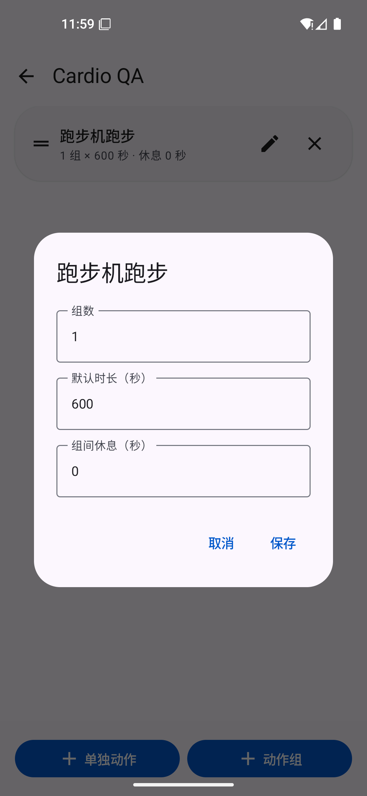
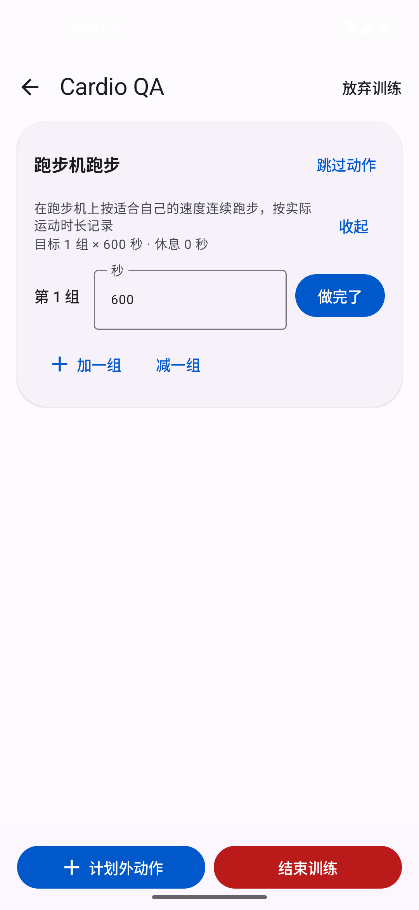
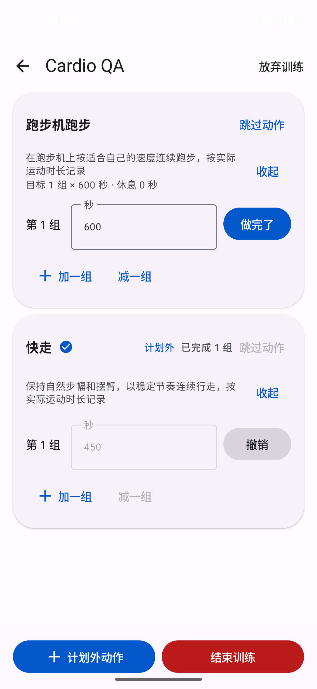

# 有氧运动界面验证

验证时间：2026-09-29 至 2026-09-30。

- 环境：Pixel 5 模拟器，Android 16 / API 36，ARM64，1080 × 2340，440 dpi，默认字体大小。
- 原版：`b5896d1`；有氧版本：`6fc90ba`。两个 APK 均从对应源码构建。
- 使用独立模拟器和 `Cardio QA` 测试方案；截图为设备原始截图，未修改界面内容。
- 原版先创建测试方案，再覆盖安装有氧版本；功能截图使用手势导航。

## 验证结果

| 场景 | 实际结果 |
| --- | --- |
| 覆盖安装升级 | 原测试方案保留，动作选择器自动出现「有氧」分类。 |
| 分类与器械筛选 | 「有氧 + 器械」显示划船机、动感单车、椭圆机、登山机、跑步机跑步、骑行，共 6 个；「有氧 + 自重」显示开合跳、快走、慢跑、跳绳，共 4 个。 |
| 加入计划 | 跑步机跑步默认 1 组 × 600 秒、休息 0 秒。 |
| 编辑目标 | 只有组数、默认时长和组间休息输入框，无重量或次数输入框。 |
| 开始训练 | 跑步机跑步只有第 1 组，预填 600 秒，可直接记录。 |
| 临时加练 | 添加计划外「快走」后，默认一组、600 秒；改成 450 秒并确认「就这样」后保存成功，没有出现休息倒计时。 |
| 强制停止并重新启动 | 重新进入「继续训练」后，快走仍显示「计划外」「已完成 1 组」和 450 秒，没有额外补成三组；计划内跑步机仍预填 600 秒。 |

测试结束时，模拟器的 crash 日志缓冲区为空。上述有氧场景通过；未进行真机或其他 Android 版本的界面验证。

## 界面对比

| 修改前：分类末尾没有有氧 | 修改后：有氧分类及动作列表 |
| --- | --- |
|  |  |

| 有氧目标编辑 | 有氧训练记录 | 重启后恢复计划外记录 |
| --- | --- | --- |
|  |  |  |

## 基线已有的界面问题

在原版 `b5896d1` 的 Android 16 三键导航模式下，「设置单日方案」页面的底部「新增单日方案」按钮被系统导航栏部分覆盖，点击按钮中心会触发系统 Home。
切换到手势导航后可以正常操作，因此本次前后对比均采用手势导航。该问题已在有氧改动前复现，本次未修改导航栏布局。

